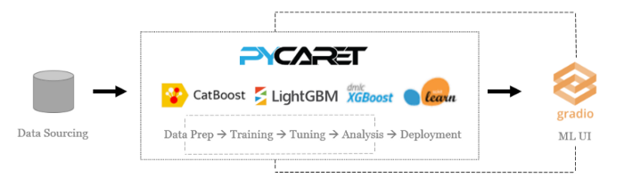

## Heart-Disease-Prediction

### Work Flow:
So we are using pycaret here,**PyCaret is an open-source, low-code machine learning library and end-to-end model management tool built-in Python for automating machine learning workflows. It is incredibly popular for its ease of use, simplicity, and ability to build and deploy end-to-end ML prototypes quickly and efficiently.**

**PyCaret is an alternate low-code library that can be used to replace hundreds of lines of code with few lines only.** This makes the experiment cycle exponentially fast and efficient.

PyCaret is simple and easy to use. All the operations performed in PyCaret are sequentially stored in a Pipeline that is fully automated for deployment. Whether it’s imputing missing values, one-hot-encoding, transforming categorical data, feature engineering, or even hyperparameter tuning, PyCaret automates all of it.

